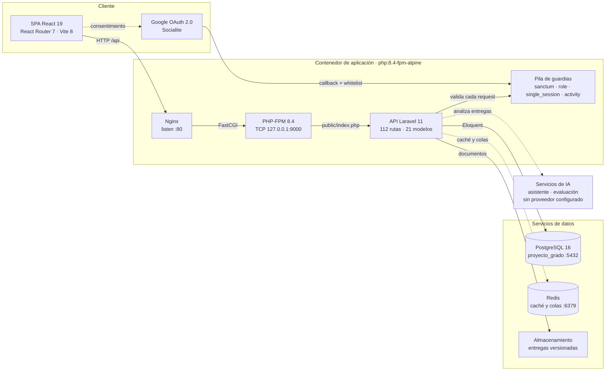
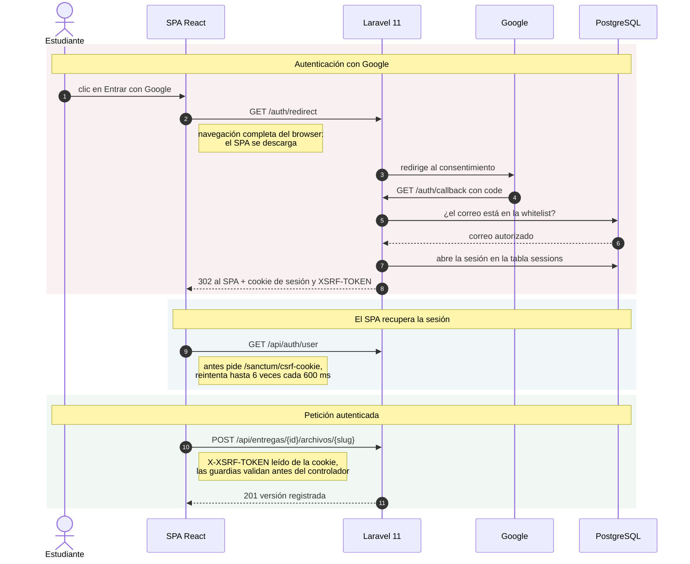
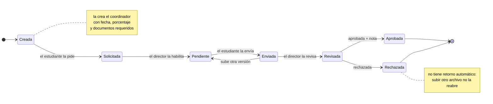

# Sistema Centralizado de Proyectos de Grado

Plataforma web para gestionar los proyectos de grado de Ingeniería de Sistemas en la **UNAB** (Universidad Autónoma de Bucaramanga). Coordinadores, directores, estudiantes y evaluadores externos trabajan sobre el mismo ciclo: inscripción, entregas con versionado, bitácoras firmadas, evaluación y reportes.

## Contenido

- [Diagramas interactivos](#diagramas-interactivos)
- [Arquitectura](#arquitectura)
- [Cómo se hablan las piezas](#cómo-se-hablan-las-piezas)
- [Ciclo de vida de una entrega](#ciclo-de-vida-de-una-entrega)
- [Stack](#stack)
- [Funcionalidades por rol](#funcionalidades-por-rol)
- [Puesta en marcha](#puesta-en-marcha)
- [Variables de entorno](#variables-de-entorno)
- [Estructura del proyecto](#estructura-del-proyecto)
- [Modelo de datos](#modelo-de-datos)
- [Rutas de la API](#rutas-de-la-api)
- [Pruebas](#pruebas)
- [Integración continua](#integración-continua)
- [Despliegue con Docker](#despliegue-con-docker)
- [Problemas frecuentes](#problemas-frecuentes)
- [Documentación adicional](#documentación-adicional)

## Diagramas interactivos

Los diagramas de abajo están incrustados como Mermaid porque GitHub no ejecuta JavaScript dentro de un README. La versión completa —con animación de trazo, zoom, búsqueda, capítulos guiados, tema claro/oscuro y exportación— vive en archivos HTML autocontenidos:

| Diagrama | Archivo | Qué muestra |
|---|---|---|
| Arquitectura | [`docs/diagramas/arquitectura.html`](docs/diagramas/arquitectura.html) | Las piezas del sistema y por dónde viaja cada petición |
| Conversación | [`docs/diagramas/conversacion.html`](docs/diagramas/conversacion.html) | El intercambio real desde el login hasta subir una entrega |
| Ciclo de vida | [`docs/diagramas/entrega.html`](docs/diagramas/entrega.html) | Los estados de una entrega y quién dispara cada transición |

Para verlos basta con abrir el archivo en el navegador; no requieren servidor ni dependencias.

```bash
xdg-open docs/diagramas/arquitectura.html   # Linux
open docs/diagramas/arquitectura.html       # macOS
```

Las fuentes de los diagramas están en `docs/diagramas/src/*.json` y se regeneran con [Archify](https://github.com/tt-a1i/archify). Cada nodo referencia el archivo y la línea del código que lo respalda.

## Arquitectura

Un único contenedor corre Nginx y PHP-FPM juntos; PostgreSQL y Redis son servicios aparte.



Puntos que conviene tener claros antes de tocar el código:

- Nginx sirve `public/` y entrega el PHP por FastCGI en `127.0.0.1:9000`. Todo lo que no empiece por `/api` ni `/storage` cae en el catch-all del SPA (`routes/web.php:47`).
- El SPA usa `fetch` con rutas relativas mediante un wrapper propio (`resources/js/lib/utils.ts:53`). No hay `axios` ni `baseURL`.
- La sesión es cookie de Sanctum en modo *stateful*, no token Bearer. La sesión vive en la tabla `sessions` porque `single_session` la consulta por `user_id`.
- `audit_logs` es una tabla de PostgreSQL con archivado programado: `routes/console.php:18` corre `audit:archive` a diario.
- La capa de IA está construida pero **sin proveedor conectado**: `AI_PROVIDER` vale `null` por defecto y cualquier llamada lanza `providerNotConfigured`. Detalle en [esta sección](#las-funciones-de-ia-no-vienen-conectadas).

## Cómo se hablan las piezas

Del clic en "Entrar con Google" hasta subir el documento de una entrega.



Detalles que suelen sorprender:

- El botón de Google es un enlace normal (`<a href="/auth/redirect">`), no un `fetch`. Por eso el SPA se recarga entero.
- Tras el callback el SPA no recibe la identidad en la redirección: la pide aparte a `/api/auth/user` y reintenta hasta seis veces.
- El evaluador externo no pasa por Google. Entra por `POST /api/auth/externo/login`, protegido con `throttle:login`.

## Ciclo de vida de una entrega

Los estados son el enum `EstadoEntrega` (`app/Enums/EstadoEntrega.php`).



Reglas que están escritas en el código:

- Solicitar exige que la entrega esté en `creacion` (`app/Actions/Entrega/SolicitarEntregaAction.php:67`).
- Habilitar exige que esté en `solicitada` (`app/Actions/Entrega/HabilitarEntregaAction.php:21`).
- Subir un archivo mientras está `pendiente` o `enviada` la devuelve a `pendiente` (`app/Http/Controllers/Api/EntregaEstudianteController.php:71`).
- Hay un tope de cuatro versiones de documento por entrega.
- El endpoint de revisión acepta `revisada`, `aprobada` o `rechazada` sin exigir estado de origen (`app/Http/Controllers/Admin/EntregaController.php:344`).

## Stack

| Capa | Tecnología |
|---|---|
| Backend | Laravel 11 · PHP `^8.2` en `composer.json`, la imagen Docker usa 8.4 |
| Frontend | React 19 · React Router 7 · Vite 8 · TypeScript |
| UI | Tailwind CSS v4 · shadcn/ui |
| Base de datos | PostgreSQL 16 en desarrollo y producción; SQLite en las pruebas |
| Autenticación | Sanctum en modo cookie SPA · Google OAuth vía Socialite |
| Caché y colas | Redis |
| Pruebas | Pest (PHP) · Playwright (E2E) |
| Servidor web | Nginx + PHP-FPM en el mismo contenedor |

## Funcionalidades por rol

**Coordinador**

- Gestión de proyectos, usuarios y whitelist de correos
- Asignación de evaluadores externos y de cupos por director
- Configuración de entregas, porcentajes y pesos de nota
- Consulta de notas ponderadas por fase y exportación a Excel
- Seguimiento por semestre, anuncios y recursos informativos
- Consulta del registro de auditoría

**Director**

- Supervisión de los proyectos asignados y KPIs
- Revisión y calificación de entregas, incluida la evaluación ABET
- Firma de bitácoras con código
- Generación de cartas de aval de sustentación y de jurados

**Estudiante**

- Subida de documentos por versión, con tope de cuatro
- Bitácoras semanales con firma por código
- Evaluación inteligente previa a la entrega y asistente académico de orientación (requieren conectar un proveedor de IA)

**Evaluador externo**

- Panel de asignaciones y calendario
- Evaluación de presentaciones de anteproyecto y final con rúbrica

## Puesta en marcha

### Requisitos

- PHP 8.2 o superior con las extensiones `pdo_pgsql`, `bcmath`, `zip`, `gd`, `intl`, `mbstring`, `xml`
- Composer 2
- Node.js 22 y pnpm 11
- Docker y Docker Compose, o bien PostgreSQL 16 y Redis instalados a mano

### 1. Clonar e instalar dependencias

```bash
git clone https://github.com/Andrejulian21/Proyecto-de-grado.git
cd Proyecto-de-grado
composer install
pnpm install
```

### 2. Configurar el entorno

```bash
cp .env.example .env
php artisan key:generate
```

Revisa al menos `DB_*`, `APP_URL` y las credenciales de Google OAuth antes de seguir.

### 3. Levantar la base de datos y Redis

```bash
docker compose up -d
```

Esto arranca `proyecto-pgsql` (PostgreSQL 16 en el puerto 5432) y `proyecto-redis` (puerto 6379). Ambos tienen healthcheck, así que espera a que reporten estado saludable.

### 4. Migrar y sembrar

```bash
php artisan migrate --seed
php artisan storage:link
```

### 5. Arrancar en desarrollo

Necesitas dos procesos:

```bash
php artisan serve          # API en http://localhost:8000
pnpm run dev               # Vite en http://localhost:5173
```

Entra por **http://localhost:5173**. El dev server de Vite hace proxy de `/api`, `/sanctum` y `/auth` hacia el `:8000`, así que las cookies de sesión funcionan sin configuración extra.

## Variables de entorno

`.env.example` está documentado y versionado. Los grupos principales:

| Grupo | Variables | Para qué |
|---|---|---|
| Aplicación | `APP_NAME`, `APP_ENV`, `APP_KEY`, `APP_DEBUG`, `APP_URL`, `APP_TIMEZONE`, `APP_LOCALE`, `BCRYPT_ROUNDS` | Identidad y modo de ejecución |
| Base de datos | `DB_CONNECTION`, `DB_HOST`, `DB_PORT`, `DB_DATABASE`, `DB_USERNAME`, `DB_PASSWORD` | Conexión a PostgreSQL |
| Sesión | `SESSION_DRIVER`, `SESSION_LIFETIME`, `SESSION_ENCRYPT`, `SESSION_PATH`, `SESSION_DOMAIN`, `SESSION_SECURE_COOKIE` | `SESSION_DRIVER=database` es obligatorio: la sesión única consulta la tabla `sessions` por `user_id` |
| Sanctum y CORS | `SANCTUM_STATEFUL_DOMAINS`, `SANCTUM_GUARD`, `SANCTUM_EXPIRATION`, `SANCTUM_CORS_ALLOWED_ORIGINS`, `FRONTEND_URL` | Qué dominios pueden usar la cookie de sesión |
| Caché y colas | `CACHE_STORE`, `CACHE_PREFIX`, `QUEUE_CONNECTION`, `REDIS_CLIENT`, `REDIS_HOST`, `REDIS_PORT`, `REDIS_PASSWORD` | Ambos apuntan a Redis por defecto |
| Almacenamiento | `FILESYSTEM_DISK`, `AWS_ACCESS_KEY_ID`, `AWS_SECRET_ACCESS_KEY`, `AWS_BUCKET`, `AWS_DEFAULT_REGION` | Disco local o S3 para los documentos |
| Correo | `MAIL_MAILER`, `MAIL_HOST`, `MAIL_PORT`, `MAIL_USERNAME`, `MAIL_PASSWORD`, `MAIL_FROM_ADDRESS` | Notificaciones; el ejemplo usa `log` |
| Google OAuth | `GOOGLE_CLIENT_ID`, `GOOGLE_CLIENT_SECRET`, `GOOGLE_REDIRECT_URI`, `GOOGLE_ALLOWED_HOSTED_DOMAIN`, `GOOGLE_ALLOWED_EMAIL_DOMAIN` | Entrada de los usuarios UNAB, restringida a `unab.edu.co` |
| Frontend | `VITE_APP_NAME`, `VITE_DEV_SERVER_HOST`, `VITE_DEV_SERVER_PORT`, `VITE_API_BASE_URL` | Configuración que Vite inyecta en el SPA |
| IA | `AI_PROVIDER` | Proveedor del asistente y de la evaluación de documentos. Por defecto `null`, ver abajo |
| Registro | `LOG_CHANNEL`, `LOG_STACK`, `LOG_LEVEL`, `LOG_DEPRECATIONS_CHANNEL` | Canales y verbosidad |

Tres detalles que importan:

- `APP_DEBUG` viene en `false` a propósito en el ejemplo, para que un despliegue que copie la plantilla tal cual no filtre variables de entorno en las páginas de error.
- El acceso por Google está limitado al dominio `unab.edu.co` y además el correo debe existir en `authorized_emails`. Son dos filtros, no uno. `GOOGLE_REDIRECT_URI` tiene que coincidir exactamente con `${APP_URL}/auth/callback`.
- Las variables `AWS_*` están en el ejemplo solo porque Laravel las trae por defecto. El proyecto no usa S3 hoy.

Nunca subas el `.env` al repositorio.

### Las funciones de IA no vienen conectadas

`AI_PROVIDER` vale `null` por defecto (`config/ai.php:24`) y el único proveedor registrado es `NullAiProvider` (`config/ai.php:36`), cuyo método `complete()` lanza `AiException::providerNotConfigured` sin más (`app/Services/Ai/Providers/NullAiProvider.php:25`).

En consecuencia, con la configuración de fábrica el asistente académico, la evaluación inteligente previa a la entrega y el análisis ABET **fallan con error de proveedor no configurado**. Toda la capa de dominio está construida —gateway, registro de proveedores, composición de prompts, estrategias e intérpretes de resultado— pero falta enchufar un proveedor real: `config/ai.php:38-40` deja comentadas las entradas para `fastapi`, `openai` y `gemini`.

Para habilitarlas hay que implementar `App\Contracts\Ai\AiProvider`, registrar la clase en `config/ai.php` y apuntar `AI_PROVIDER` a esa clave. El gateway no necesita cambios.

## Estructura del proyecto

```
app/
├── Actions/            Casos de uso de entregas, directores y cartas
├── Enums/              UserRole, FaseProyecto, EstadoEntrega, EstadoFirma, ...
├── Http/
│   ├── Controllers/    Api/ (por actor) y Admin/ (coordinación)
│   ├── Middleware/     RoleMiddleware, SingleSessionMiddleware, ActivityMiddleware
│   └── Requests/       Validación de formularios
├── Models/             21 modelos Eloquent
├── Policies/           BitacoraPolicy, EntregaPolicy, UserPolicy
└── Services/
    ├── Ai/             Gateway, registro de proveedores y composición de prompts
    ├── Assistant/      Asistente académico y estrategias de orientación
    ├── Documents/      Conversión de DOCX y PDF a Markdown
    ├── Evaluation/     Evaluación de documentos, ABET y previa a la entrega
    └── Directors/      Perfil académico y guardas de asignación

resources/js/
├── components/         Componentes React compartidos
├── contexts/           GruposContext (semestres)
├── hooks/              useAuth y 23 hooks más
├── lib/                apiFetch y utilidades
├── pages/              coordinador (14) · director (10) · estudiante (7) · evaluador (7) · shared (5)
├── types/              Definiciones TypeScript
└── app.tsx             Rutas del SPA y ProtectedRoute

docs/diagramas/         Diagramas HTML autocontenidos y sus fuentes JSON
e2e/                    Pruebas de extremo a extremo con Playwright
```

## Modelo de datos

65 migraciones producen 31 tablas. Las del dominio académico:

| Tabla | Para qué |
|---|---|
| `users` | Cuentas de los cuatro roles, con bloqueo por intentos fallidos |
| `authorized_emails` | Whitelist de correos que pueden entrar por Google |
| `semestres` | Periodos académicos |
| `proyectos` | Proyecto de grado, con fase y estado |
| `proyecto_estudiante` | Pivote: estudiantes de cada proyecto |
| `entregas` | Entrega configurable, con fecha, porcentaje y documentos requeridos |
| `entrega_proyecto` | Pivote: entregas asignadas a cada proyecto |
| `versiones_documento` | Versiones subidas por el estudiante, máximo cuatro |
| `bitacoras` | Bitácoras semanales con firma por código |
| `evaluador_proyecto` | Pivote: evaluadores externos asignados |
| `evaluaciones`, `evaluaciones_evaluador` | Rúbricas y notas de las presentaciones |
| `director_academic_profiles` | Perfil académico y cupos del director |
| `coordinador_grade_weights` | Pesos de nota configurados por el coordinador |
| `seguimiento_observaciones` | Observaciones de seguimiento por semestre |
| `ai_document_evaluations` | Resultados de la evaluación automática de documentos |
| `ai_assistant_conversations`, `ai_assistant_messages` | Historial del asistente académico |
| `anuncios`, `notificaciones`, `recursos_informativos` | Comunicación hacia los usuarios |
| `audit_logs`, `audit_logs_archive` | Rastro de acciones y su archivo histórico |

El resto son tablas de infraestructura de Laravel: `sessions`, `cache`, `cache_locks`, `jobs`, `job_batches`, `failed_jobs`, `password_reset_tokens` y `personal_access_tokens`.

## Rutas de la API

112 rutas repartidas en cuatro bloques por nivel de protección:

| Bloque | Middleware | Contenido |
|---|---|---|
| Público | ninguno | `GET /api/health`, `POST /api/auth/externo/login` con `throttle:login` |
| Autenticado | `auth:sanctum`, `single_session`, `activity` | Auth, bitácoras, estudiante, entregas, evaluaciones, director, evaluador, anuncios y notificaciones |
| Coordinación | los anteriores más `role:Coordinador` | `admin/usuarios`, `whitelist`, `proyectos`, `semestres`, `reportes`, `seguimiento`, `notas`, `audit-logs` y más |
| Entregas admin | los autenticados, **sin** `role` | `admin/entregas`: el control de acceso lo resuelve `EntregaPolicy`, no el router. Coordinador hace el CRUD, el director revisa y habilita, el estudiante solicita y borra versiones |

Fuera de la API, `routes/web.php` expone el health check, el par `/auth/redirect` y `/auth/callback` de Google, la descarga protegida `/storage/{path}` bajo `auth:sanctum`, y el catch-all que sirve el SPA.

## Pruebas

138 archivos de prueba con Pest. La suite corre sobre SQLite en memoria (`phpunit.xml:41`), no sobre PostgreSQL.

```bash
vendor/bin/pest                       # toda la suite
vendor/bin/pest --filter=Entrega      # por nombre
vendor/bin/pest tests/Feature/Auth    # por carpeta
vendor/bin/pint --test                # estilo, sin escribir
vendor/bin/pint                       # estilo, corrigiendo
pnpm run typecheck                    # tsc --noEmit
```

Las pruebas de extremo a extremo viven en `e2e/`, con Playwright y su propio `package.json`:

```bash
cd e2e && pnpm install && pnpm exec playwright test
```

Cubren el flujo de entregas y evaluación (`e2e/entregas-evaluacion.spec.ts`).

## Integración continua

`.github/workflows/ci.yml` corre un solo job con PostgreSQL como servicio:

1. Instala dependencias de Composer con caché
2. Copia `.env.example` y genera la clave de la aplicación
3. Espera a que PostgreSQL responda y corre `php artisan migrate --force`
4. Ejecuta `vendor/bin/pest`
5. Verifica el estilo con `vendor/bin/pint --test`
6. Instala dependencias con pnpm, compila el frontend y corre `pnpm run typecheck`

## Despliegue con Docker

El `Dockerfile` tiene tres etapas:

1. **frontend** — `node:22-alpine` compila los assets con pnpm
2. **vendor** — `php:8.4-fpm-alpine` instala dependencias de producción y optimiza el autoload
3. **runtime** — `php:8.4-fpm-alpine` con Nginx y la extensión Redis

```bash
docker build -t proyecto-grado .
docker run -p 8080:80 --env-file .env proyecto-grado
```

Notas del runtime:

- `docker-start.sh` arranca PHP-FPM en segundo plano, valida la configuración de Nginx y deja Nginx en primer plano.
- El healthcheck consulta `http://127.0.0.1/api/health` cada 30 segundos.
- El contenedor **no** corre migraciones al arrancar. Ejecútalas aparte:
  ```bash
  docker exec -it <contenedor> php artisan migrate --force
  ```
- Los límites de subida están en 64 MB (`upload_max_filesize` y `post_max_size`).

## Problemas frecuentes

**El login con Google deja el SPA en blanco o rebota a `/login`**

El SPA pide `/api/auth/user` hasta seis veces tras el callback. Si todas fallan, la cookie de sesión no está llegando. Revisa que `APP_URL` coincida con el dominio del navegador, que `SESSION_SECURE_COOKIE` sea coherente con HTTP o HTTPS, y que el correo esté en `authorized_emails`.

**`419 Page Expired` al enviar un formulario**

Falta el token CSRF. El wrapper `apiFetch` lo toma de la cookie `XSRF-TOKEN`; si la cookie no existe, pide antes `GET /sanctum/csrf-cookie`. Ten en cuenta que el interceptor maneja 401 y 403, pero no 419.

**La sesión se cierra sola al entrar desde otro navegador**

Es el comportamiento esperado de `SingleSessionMiddleware`: una sola sesión activa por usuario.

**`could not connect to server` al migrar**

Verifica que el contenedor esté arriba con `docker compose ps` y que `DB_HOST` apunte a `127.0.0.1` cuando corres Laravel fuera de Docker.

**Las pruebas pasan pero producción falla**

La suite corre en SQLite y producción en PostgreSQL. Ante una diferencia sospechosa, reproduce el caso apuntando `DB_CONNECTION=pgsql` antes de dar el fallo por descartado.

## Documentación adicional

| Documento | Contenido |
|---|---|
| [`docs/ARQUITECTURA.md`](docs/ARQUITECTURA.md) | Decisiones de arquitectura en detalle |
| [`docs/Backend.md`](docs/Backend.md) | Convenciones del backend |
| [`docs/Frontend.md`](docs/Frontend.md) | Convenciones del frontend |
| [`docs/DECISIONES.md`](docs/DECISIONES.md) | Registro de decisiones |
| [`docs/PRINCIPIOS.md`](docs/PRINCIPIOS.md) | Principios de desarrollo del equipo |
| [`docs/PLAN-MAESTRO.md`](docs/PLAN-MAESTRO.md) | Plan maestro del proyecto |
| [`docs/ROADMAP.md`](docs/ROADMAP.md) | Hoja de ruta |

## Proyecto académico

Desarrollado como proyecto de grado del Programa de Ingeniería de Sistemas — Universidad Autónoma de Bucaramanga.
