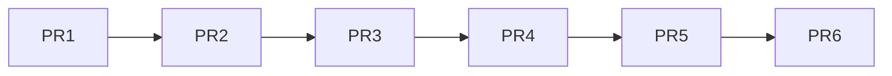

# Spec: Coordinator Integration — Full Frontend-Backend Connection

## Purpose

Wire all coordinator frontend pages from mock data to real backend API endpoints. Break the work into 6 chained PRs (feature-branch-chain), each independently mergeable. Remove static mocks from 9 of 11 coordinator pages while preserving UI skeletons, empty/error/loading states, and role-gated access.

## Chained PRs



---

## PR1: Dashboard KPIs + Supervision Read-Only + Sidebar Fixes

### Files

| Action | File |
|--------|------|
| MODIFY | `resources/js/pages/dashboard/CoordinadorDashboard.tsx` |
| CREATE | `resources/js/components/supervision/SupervisionReadOnly.tsx` |
| MODIFY | `resources/js/components/layout/Sidebar.tsx` |

### Requirements

| # | Requirement | RFC 2119 |
|---|-------------|----------|
| R1.1 | CoordinadorDashboard MUST fetch KPIs from `/api/admin/proyectos/kpis` via `apiFetch` | MUST |
| R1.2 | KPI cards (Proyectos activos, En riesgo, Alertas sin revisar, Tasa de cumplimiento) MUST display live data | MUST |
| R1.3 | A loading skeleton SHALL render while the API call is in-flight | SHALL |
| R1.4 | An error toast SHALL appear when the API call fails | SHALL |
| R1.5 | The supervision link in the project table MUST navigate to SupervisionReadOnly | MUST |
| R1.6 | SupervisionReadOnly MUST display project name, students, current phase, phase deliveries, and student submissions | MUST |
| R1.7 | SupervisionReadOnly MUST hide all edit controls, observation fields, and signature buttons | MUST |
| R1.8 | SupervisionReadOnly SHALL reuse the layout of SupervisionProyectoDirector | SHALL |
| R1.9 | Sidebar "Panel" item MUST show active state when on `/dashboard/coordinador` | MUST |
| R1.10 | Sidebar "Anuncios" item MUST NOT activate the public Anuncios sidebar entry | MUST |

### API Endpoints

| Method | Endpoint | Use |
|--------|----------|-----|
| GET | `/api/admin/proyectos/kpis` | Fetch KPI values |

### Data Flow

```
CoordinadorDashboard
  ├─ useEffect → apiFetch('/api/admin/proyectos/kpis')
  │   ├─ pending → Skeleton cards
  │   ├─ rejected → toast.error("Error al cargar KPIs")
  │   └─ fulfilled → render 4 KPI StatCards
  └─ Project table row "Ver" → navigate(`/dashboard/coordinador/proyecto/${id}`)
        └─ SupervisionReadOnly → fetch project detail → render read-only view
```

### States

| Component | Loading | Empty | Error | Success |
|-----------|---------|-------|-------|---------|
| KPI cards | 4 skeleton cards | "Sin datos" with icon | toast + retry button | 4 cards with values |
| Project table | Skeleton rows | "No hay proyectos registrados" | Inline error banner | Rows with actions |
| SupervisionReadOnly | Spinner | — | Error banner | Full read-only view |

### Acceptance Criteria

- [ ] Dashboard renders 4 KPI cards with real data within 3 seconds
- [ ] Loading skeletons visible while API is pending
- [ ] Error toast fires when API returns 4xx/5xx
- [ ] "Ver" on project row navigates to SupervisionReadOnly
- [ ] SupervisionReadOnly shows student deliveries but hides all action buttons
- [ ] Sidebar "Panel" is highlighted on `/dashboard/coordinador`
- [ ] Sidebar "Anuncios" (admin) and "Anuncios" (public) highlight independently

### Edge Cases

- KPI endpoint returns `null` for a card → display "—" or 0
- User navigates to `/dashboard/coordinador/proyecto/:id` with invalid ID → 404 state
- Network timeout → retry mechanism with exponential backoff

---

## PR2: GestionProyectos Reformulation

### Files

| Action | File |
|--------|------|
| REPLACE | `resources/js/pages/coordinador/GestionProyectos.tsx` |

### Requirements

| # | Requirement | RFC 2119 |
|---|-------------|----------|
| R2.1 | A group/semester selector dropdown MUST filter the project table below | MUST |
| R2.2 | The project table MUST show real data from `/api/admin/proyectos` | MUST |
| R2.3 | Edit action MUST open a form to change title, students, and director | MUST |
| R2.4 | Delete action MUST show confirmation dialog and call the delete endpoint | MUST |
| R2.5 | A "Crear grupo" form MUST accept group name and date | MUST |
| R2.6 | Director cupo table MUST show: name, specialization areas, active projects vs max capacity | MUST |
| R2.7 | Max capacity input MUST validate that max >= active projects currently assigned | MUST |
| R2.8 | Create-project form MUST include: group dropdown, title input, director dropdown, student selector (1–3) | MUST |
| R2.9 | Student selector MUST provide autocomplete search filtered to Estudiante role | MUST |
| R2.10 | At least 1 student MUST be selected before form submission | MUST |

### API Endpoints

| Method | Endpoint | Use |
|--------|----------|-----|
| GET | `/api/admin/proyectos` | List projects (filter by group) |
| POST | `/api/admin/proyectos` | Create project |
| PUT | `/api/admin/proyectos/{id}` | Edit project |
| DELETE | `/api/admin/proyectos/{id}` | Delete project |
| GET | `/api/admin/proyectos/grupos` | List project groups |
| POST | `/api/admin/proyectos/grupos` | Create group |
| GET | `/api/admin/directores/cupos` | List director capacities |
| PUT | `/api/admin/directores/{id}/cupo` | Update director max capacity |
| GET | `/api/admin/usuarios?role=estudiante` | Student autocomplete |

### Data Flow

```
GestionProyectos
  ├─ GroupSelector → apiFetch('/api/admin/proyectos/grupos')
  │     └─ selected → filter project table + entregas context
  ├─ ProjectTable → apiFetch('/api/admin/proyectos?grupo_id=X')
  │     └─ rows → Edit / Delete actions
  ├─ CupoTable → apiFetch('/api/admin/directores/cupos')
  │     └─ editable max input → PUT on save
  └─ CreateProjectForm
        ├─ group dropdown → from groups list
        ├─ director dropdown → from directors list
        └─ student autocomplete → debounced apiFetch → select up to 3
```

### States

| Component | Loading | Empty | Error | Success |
|-----------|---------|-------|-------|---------|
| Group selector | Skeleton dropdown | "Sin grupos" — show create button | Toast | Dropdown populated |
| Project table | Skeleton rows | "No hay proyectos en este grupo" | Inline error | Table with data |
| Cupo table | Skeleton rows | "Sin directores" | Inline error | Editable rows |
| Create form | — | — | Field-level validation errors | Submit + redirect |
| Student autocomplete | Spinner in dropdown | "Sin resultados" | Toast | Up to 3 selected |

### Acceptance Criteria

- [ ] Group selector dropdown populates from API and filters project table
- [ ] Create/edit/delete project operations persist to backend
- [ ] Director max capacity validates >= active projects on submit
- [ ] Student autocomplete returns Estudiante users; max 3 selectable
- [ ] Confirmation modal appears before delete
- [ ] Validation errors render inline per field

### Edge Cases

- Director has 3 active projects, max set to 2 → validation blocks save
- Group has no projects → empty state with create prompt
- Student already assigned to another project in same group → backend error handled gracefully
- Autocomplete returns 100+ students → paginated display

---

## PR3: Directores Page (New)

### Files

| Action | File |
|--------|------|
| CREATE | `resources/js/pages/coordinador/DirectoresPage.tsx` |
| MODIFY | `resources/js/app.tsx` |
| MODIFY | `resources/js/components/layout/Sidebar.tsx` |

### Requirements

| # | Requirement | RFC 2119 |
|---|-------------|----------|
| R3.1 | `/directores` route MUST render director cards with name and specialization areas | MUST |
| R3.2 | Each card MUST have two action buttons: "Ver bitácoras" and "Ver proyectos" | MUST |
| R3.3 | "Ver bitácoras" MUST show the director's projects as cards, then navigate to bitácora viewer on click | MUST |
| R3.4 | "Ver proyectos" MUST show the director's projects as cards, then open SupervisionReadOnly on click | MUST |
| R3.5 | Sidebar MUST include "Directores" for the coordinador role only | MUST |

### API Endpoints

| Method | Endpoint | Use |
|--------|----------|-----|
| GET | `/api/admin/directores` | List all directors |
| GET | `/api/admin/directores/{id}/proyectos` | Director's projects |
| GET | `/api/admin/proyectos/{id}/bitacoras` | Project bitácoras |

### Data Flow

```
DirectoresPage
  └─ apiFetch('/api/admin/directores') → card grid
       ├─ [Ver bitácoras] → apiFetch('/api/admin/directores/{id}/proyectos')
       │     └─ project card click → apiFetch('/api/admin/proyectos/{id}/bitacoras')
       │           └─ bitácora viewer (reused component)
       └─ [Ver proyectos] → apiFetch('/api/admin/directores/{id}/proyectos')
             └─ project card click → SupervisionReadOnly
```

### States

| Component | Loading | Empty | Error | Success |
|-----------|---------|-------|-------|---------|
| Director cards | Skeleton grid | "No hay directores registrados" | Toast + retry | Card grid |
| Project sub-view | Spinner | "Sin proyectos asignados" | Inline error | Project cards |
| Bitácora viewer | Spinner | "Sin bitácoras registradas" | Inline error | Bitácora list |

### Acceptance Criteria

- [ ] `/directores` renders all directors from API
- [ ] "Ver bitácoras" shows director's project cards; clicking a card shows its bitácoras
- [ ] "Ver proyectos" shows director's project cards; clicking opens read-only supervision
- [ ] "Directores" appears in sidebar for coordinador only
- [ ] Back navigation works from sub-views

### Edge Cases

- Director with 0 projects → both action buttons show empty states
- Director with 10+ projects → scrollable card list
- Bitácora viewer for project with 0 bitácoras → empty state

---

## PR4: AsignacionEvaluadores Reformulation

### Files

| Action | File |
|--------|------|
| REPLACE | `resources/js/pages/coordinador/AsignacionEvaluadores.tsx` |

### Requirements

| # | Requirement | RFC 2119 |
|---|-------------|----------|
| R4.1 | Assignment table MUST show: project ID, name, students, evaluators (2–3), evaluation date/time | MUST |
| R4.2 | Edit action MUST open modal to change date, time, and evaluators | MUST |
| R4.3 | Delete action MUST show confirmation and call delete endpoint | MUST |
| R4.4 | A visual calendar grid MUST display scheduled evaluations | MUST |
| R4.5 | Results table MUST show: project, students, director, phase, evaluators, average score | MUST |
| R4.6 | Registration form MUST accept: project, phase (Anteproyecto/Final), 2 required + 1 optional evaluator, date/time | MUST |
| R4.7 | All data MUST come from `/api/admin/evaluador-proyecto` and `/api/evaluaciones` | MUST |

### API Endpoints

| Method | Endpoint | Use |
|--------|----------|-----|
| GET | `/api/admin/evaluador-proyecto` | List assignments |
| POST | `/api/admin/evaluador-proyecto` | Create assignment |
| PUT | `/api/admin/evaluador-proyecto/{id}` | Edit assignment |
| DELETE | `/api/admin/evaluador-proyecto/{id}` | Delete assignment |
| GET | `/api/evaluaciones` | List evaluation results |

### Data Flow

```
AsignacionEvaluadores
  ├─ AssignmentTable → apiFetch('/api/admin/evaluador-proyecto')
  │     └─ Edit modal / Delete confirm
  ├─ RegistrationForm → POST /api/admin/evaluador-proyecto
  │     ├─ project dropdown → from active projects
  │     ├─ evaluator selectors (2 required + 1 optional)
  │     └─ date/time pickers
  ├─ CalendarGrid → derived from assignment data
  └─ ResultsTable → apiFetch('/api/evaluaciones')
```

### States

| Component | Loading | Empty | Error | Success |
|-----------|---------|-------|-------|---------|
| Assignment table | Skeleton rows | "No hay asignaciones" | Inline error | Table rows |
| Calendar grid | Skeleton cells | "Sin eventos programados" | Inline error | Populated grid |
| Results table | Skeleton rows | "Sin resultados registrados" | Inline error | Table with scores |
| Registration form | — | — | Field errors | Submit + toast |

### Acceptance Criteria

- [ ] Assignment table lists all evaluador-proyecto records
- [ ] Edit modal updates date, time, evaluators
- [ ] Calendar grid shows scheduled evaluations as visual entries
- [ ] Results table shows average scores per project
- [ ] Form enforces 2–3 evaluators; phase selection filters available projects

### Edge Cases

- Project already has 3 evaluators → edit modal shows "remove" button
- Calendar grid for month with 0 evaluations → empty calendar with "Sin eventos"
- Evaluation with 0 evaluator responses → "Pendiente" in results table
- Same evaluator assigned twice → validation error

---

## PR5: GestionUsuarios Reformulation

### Files

| Action | File |
|--------|------|
| REPLACE | `resources/js/pages/coordinador/GestionUsuarios.tsx` |

### Requirements

| # | Requirement | RFC 2119 |
|---|-------------|----------|
| R5.1 | A single unified table MUST show: name, email, role (editable dropdown), last access timestamp | MUST |
| R5.2 | Role dropdown changes MUST persist via API save per user | MUST |
| R5.3 | Delete action MUST show confirmation and call delete endpoint | MUST |
| R5.4 | When whitelist email is added, user MUST appear in table immediately (no login required) | MUST |
| R5.5 | Table MUST combine data from `/api/admin/usuarios`, `/api/admin/whitelist`, `/api/admin/evaluadores` | MUST |

### API Endpoints

| Method | Endpoint | Use |
|--------|----------|-----|
| GET | `/api/admin/usuarios` | List all users |
| PUT | `/api/admin/usuarios/{id}/role` | Change user role |
| DELETE | `/api/admin/usuarios/{id}` | Delete user |
| GET | `/api/admin/whitelist` | List whitelisted emails |
| POST | `/api/admin/whitelist` | Add email to whitelist |
| DELETE | `/api/admin/whitelist/{id}` | Remove from whitelist |
| GET | `/api/admin/evaluadores` | List evaluators |

### Data Flow

```
GestionUsuarios
  └─ Unified table merges:
       ├─ apiFetch('/api/admin/usuarios') → registered users
       ├─ apiFetch('/api/admin/whitelist') → whitelisted (not yet logged in)
       └─ apiFetch('/api/admin/evaluadores') → external evaluators
       → merged rows with: name, email, role badge + dropdown, last_access
  ├─ Role change → apiFetch PUT → re-fetch table
  ├─ Delete → confirm modal → apiFetch DELETE → re-fetch table
  └─ Add whitelist → apiFetch POST → user row appears immediately
```

### States

| Component | Loading | Empty | Error | Success |
|-----------|---------|-------|-------|---------|
| Unified table | Skeleton rows | "No hay usuarios" | Inline error + retry | Populated table |
| Whitelist form | — | — | Field error | Row appears instantly |
| Role save | Button spinner | — | Toast error | Toast success + refresh |

### Acceptance Criteria

- [ ] Single table merges usuarios + whitelist + evaluadores
- [ ] Role dropdown changes persist on save click
- [ ] Whitelist addition shows user row immediately (pre-login)
- [ ] Last access column shows timestamp or "Nunca"
- [ ] Delete confirmation prevents accidental removal

### Edge Cases

- Whitelist entry has no user account yet → show "Pendiente" role badge
- User deleted while edit is in-flight → handle 404 gracefully
- Evaluator also appears in usuarios → deduplicate by email, prefer usuarios row
- Role change on self → block with "No puedes cambiar tu propio rol"

---

## PR6: Entregas + Alertas + RecursosAdmin

### Files

| Action | File |
|--------|------|
| REPLACE | `resources/js/pages/coordinador/CoordinadorEntregas.tsx` |
| MODIFY | `resources/js/pages/coordinador/GestionAlertas.tsx` |
| MODIFY | `resources/js/pages/coordinador/RecursosAdmin.tsx` |

### Requirements

#### Entregas

| # | Requirement | RFC 2119 |
|---|-------------|----------|
| R6.1 | Create entrega form MUST select: project group, fase (auto-sequential), delivery date, max time, description, acceptance criteria | MUST |
| R6.2 | Fases MUST follow fixed sequence: Anteproyecto → Presentación Anteproyecto → Desarrollo → Presentación Final | MUST |
| R6.3 | Entregas table MUST filter by group + phase + delivery | MUST |
| R6.4 | All data MUST come from `/api/admin/entregas` | MUST |

#### Alertas

| # | Requirement | RFC 2119 |
|---|-------------|----------|
| R6.5 | Rule 1: Unsigned bitácoras MUST alert after **1 hour** of student submission | MUST |
| R6.6 | Rule 2: Unsubmitted entregas MUST alert after deadline | MUST |
| R6.7 | Rule 3: Directors signing >2 bitácoras in 1 hour MUST trigger alert | MUST |
| R6.8 | Alert data MUST derive from bitácora and entrega endpoints | MUST |

#### RecursosAdmin

| # | Requirement | RFC 2119 |
|---|-------------|----------|
| R6.9 | File upload MUST use real form submission (not setTimeout fake) | MUST |
| R6.10 | Uploaded resource MUST show preview before saving | MUST |
| R6.11 | Edit resource MUST allow changing title, description, and file | MUST |

### API Endpoints

| Method | Endpoint | Use |
|--------|----------|-----|
| GET | `/api/admin/entregas` | List deliveries (filters: group, fase, entrega) |
| POST | `/api/admin/entregas` | Create delivery |
| GET | `/api/admin/bitacoras` | Bitácoras for alert rules |
| GET | `/api/admin/recursos` | List resources |
| POST | `/api/admin/recursos` | Upload resource (multipart) |
| PUT | `/api/admin/recursos/{id}` | Edit resource |
| DELETE | `/api/admin/recursos/{id}` | Delete resource |

### Data Flow

```
CoordinadorEntregas
  ├─ Group selector → filter context
  ├─ Create form → POST /api/admin/entregas
  │     └─ fase auto-computed from last entrega of group
  └─ Entregas table → GET /api/admin/entregas?grupo_id=X&fase=Y

GestionAlertas
  ├─ Rule 1 → GET bitácoras with firma_timestamp IS NULL AND created_at < NOW() - 1h
  ├─ Rule 2 → GET entregas with deadline < NOW() AND no submission
  └─ Rule 3 → GET bitácoras firmadas grouped by director, count > 2/hr

RecursosAdmin
  ├─ Upload → POST /api/admin/recursos (FormData)
  ├─ Preview → temporary URL display
  └─ Edit → PUT /api/admin/recursos/{id}
```

### States

| Component | Loading | Empty | Error | Success |
|-----------|---------|-------|-------|---------|
| Entregas table | Skeleton rows | "Sin entregas para este filtro" | Inline error | Filtered table |
| Create entrega form | — | — | Field errors | Submit + toast |
| Alertas panel | Skeleton cards | "Sin alertas activas" | Inline error | Alert cards |
| Recursos grid | Skeleton grid | "Sin recursos" | Upload error toast | Resource cards |
| Preview modal | Spinner | — | "Error al previsualizar" | File preview |

### Acceptance Criteria

- [ ] Create entrega auto-selects next sequential fase for group
- [ ] Entregas table filters by group, fase, and specific delivery
- [ ] Alert rule 1 fires 1 hour after student submits unsigned bitácora
- [ ] Alert rule 2 fires after delivery deadline with no submission
- [ ] Alert rule 3 fires when director signs >2 bitácoras in 1 hour
- [ ] RecursosAdmin uploads real files showing preview and editable metadata
- [ ] No setTimeout-based mock remains in RecursosAdmin

### Edge Cases

- Group with no existing entregas → fase defaults to "Anteproyecto"
- Student submits bitácora at 14:00 → alert fires at 15:00 if unsigned
- Deadline at midnight, no submission → alert on next poll after deadline
- Director signs 2 at 09:50 and 1 at 10:05 → 3 in 15 min → alert fires
- Upload fails due to file size → show validation error
- Multipart upload with no file selected → field-level error

---

## Sidebar Final State

After all PRs merge, sidebar shows for coordinador role:

```
Panel → /dashboard/coordinador
Proyectos → /coordinador/proyectos
Directores → /directores
Evaluadores → /coordinador/evaluadores
Usuarios → /coordinador/usuarios
Anuncios → /coordinador/anuncios
Alertas → /coordinador/alertas
Entregas → /coordinador/entregas
Recursos Admin → /coordinador/recursos
```

**Removed from sidebar (routes preserved in router):** Bitácoras, Semestre, Reportes

---

## Cross-Cutting Concerns

| Concern | Approach |
|---------|----------|
| Loading states | Skeleton loaders matching content shape; `<Loader2>` spinner for inline waits |
| Error handling | `toast.error()` for global failures; inline error banners for section failures |
| Empty states | Centered message with relevant icon + CTA where applicable |
| Auth | Sanctum cookie automatically sent via `apiFetch`; 401 → redirect to login |
| Type safety | All API responses typed with TypeScript interfaces; runtime guards for critical shapes |
| Accessibility | All interactive elements have `aria-label`; tables have `aria-describedby`; focus management on modals |
